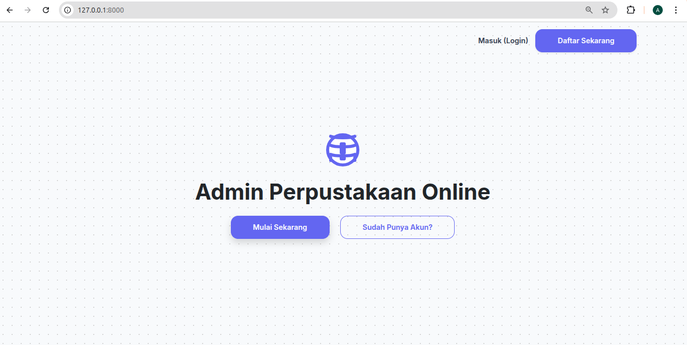
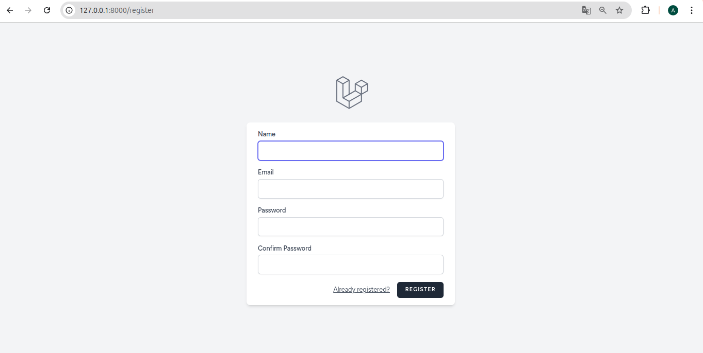
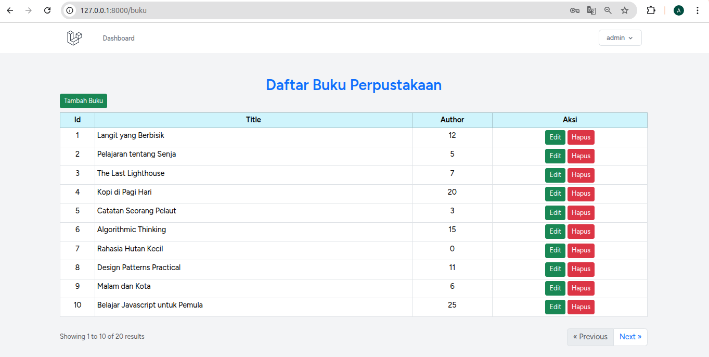

# CRUD Perpustakaan Sederhana

Aplikasi sederhana untuk mengelola data buku di perpustakaan menggunakan **Laravel**.  
Pengguna dapat melakukan operasi CRUD (Create, Read, Update, Delete) untuk data buku.

---

## 📦 Fitur

- Menampilkan daftar buku
- Menambahkan buku baru
- Mengedit data buku
- Menghapus buku
- Mengelola stok buku

---

## 🛠️ Teknologi

- **Backend:** Laravel 10
- **Database:** MySQL
- **Frontend:** Blade template
- **Dependency Management:** Composer

---

## Halaman welcome

---

## Halaman register

---

## Halaman dashboard

